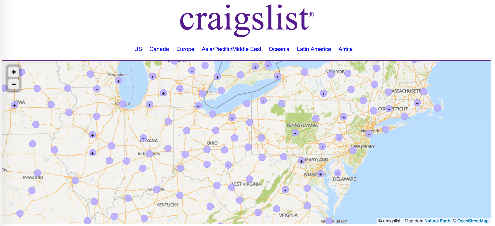

#Scraping the Web

##Background and setup - I'm going to 'install' some ideas in you.

Scraping the web for data is about mapping one representation into another, often a database.  With this transformation of information into a local context, certain information maybe lost, or abstracted.  Thusly, the idea of scraping the web can be hard, but doing the actual scraping is usually straight forward.  

The important thing to understand is not the mapping of context from one technical medium - the web, to another - a database.  But instead the ideological mapping, from a dynamic context to a static one.  For this we need metadata about our web information and semantic information about the domain we are scraping.  This will allow us the ability to compress unnecessary information, infer missing data from backend processes we can't see, and make sense of the unstructured semantics of the web.

What this translates to?  Taking information from one database and sending it to another, via a Rube Goldberg machine of tools and techniques.

##A Trivial Example

Getting started with web scraping is pretty straight forward.  However the skill level needed to do web scraping right goes from simple to intermediate to advanced.  We'll try to treat each of the necessary pieces in kind, moving through different types of concerns section by section.  By the end of this document, you should be an expert in scraping any kind of web site, for any reason.

So, let's scrape something!

From the command line run:

`pip install requests`

if you don't have pip you can get [pip here](https://pip.pypa.io/en/stable/installing/)

```
r = requests.get("https://www.google.com")
print(r.url)
print(r.text)
```

We can treat `requests.get([website])` as the same thing as pointing your browser to `[website]`.  The returned objected, abbreviated as `r`, stands for response.  As in the response from one of google's servers to the `get` request issued by `requests`.


##How do I even?

The first thing to note, if you ran the above commands (either via a python shell or saving things to a script), is that you just get back a string.  So how do you pull out meaningful information from this?

There are a number of great tools for scraping the web, but my personal favorite is lxml.  To get lxml you may have to do a little work, but it's worth it (and then some!).  

[lxml's documentation](http://lxml.de/installation.html) recommends doing the following:

`STATIC_DEPS=true sudo pip install lxml`

Which might be wrong, depending on your build - the key is you'll need `libxml2` and `libxslt`, which don't come with mac.  When I was running into this problem I used brew to install `libxml2` and `libxslt`:

`brew install libxml2 libxslt`

As an alternative, you could always get an linux vm (I recommend ubuntu) and install everything there.  Sadly, that's out of scope for this tutorial, but I'm happy to do another one on installing vm's and post it here.  

So, why did I ask you to go through all that effort?

```
import requests
import lxml.html

r = requests.get("https://www.google.com")
html = lxml.html.fromstring(r.text)
print(html.xpath("//a/@href"))
```

`lxml` exposes a parser for html pages that is superb.  The parser can be used a lot of ways, but I'd say the canonical way is to make use of the `xpath` api exposed through the library.  If you're unfamiliar with xpath, you can kind of think it like regular expressions for parsing web pages.  We'll make deep use of it throughout this tutorial, so it's recommended that you find a reference or two.

* [w3 schools](http://www.w3schools.com/xsl/xpath_intro.asp) has a good tutorial on this.  

* [Some advanced examples](https://renderman.pixar.com/resources/current/RenderMan/xPathExamples.html).

Let's start with understanding how xpath treats a document and then we'll move into the specifics of the above xpath query.  

lxml treats html documents as Directed Acyclic Graph's, typically referred to as trees.  The root of the document is the highest level - the openning and closing `<html>`,`</html>` tags.  Each layer of tree is one level deeper in the tag hierarchy so, in the following html:

```
<html>
<head>
	<title></title>
</head>
<body>
	<p>Hello</p>
</body>
</html>
```

The second layer is the head tag and the body tag.  At the third layer is the title tag and the p tag.  As should be clear from the example - the layer of your tag is determined by how many other tags enclose it.  The more tags enclose the tag your interested in, the deep in the tree it exists.

Let's break down the above xpath "query".

`//[tag]` - says search the whole document, at every layer for this [tag] type.  In our case - `//a` will return all the a tags.  

`/@[attribute]` - The `@` symbol is used to denote a tag attribute - and specifically return everything of this type.  Assuming the attribute is defined for the tag - in this case `//a/@href` returns the hyper link for the a tag.

What happens when we want other attributes or data?  

In the case of wanting other attributes we can make use of a whole host of methods to get the relevant metadata (aka the values of certain attributes) or we can get the text used for the hyper links via the following:

```
import requests
import lxml.html

r = requests.get("https://www.google.com")
html = lxml.html.fromstring(r.text)
print("Names of links:")
print([elem.text_content() for elem in html.xpath("//a")])
print("Links themselves:")
print(html.xpath("//a/@href"))
```

All done ;)

#Understanding What We Are Scraping

Now that we have some notion of how to scrape data from the internet, I'm going to bring in some background into what we'll be scraping.  In this case we'll be scraping backpage - looking instances of human trafficking.  Understanding that the data is out there, is not enough to bring people to justice for the things they've done, but it's a start.

The truth is we are investigating a set of complex actors that work, often times together in complex ways.  Capturing this complexity can be a challenge.  But it's best to start with the market place.  By understanding how to get information from backpage, we can abstract out to the pocket websites which capture information about sex slavery.  To put a more economic context to our understanding - backpage can be thought of as the supply side of sex slavery whereas, understanding the buyers, informs the demand side.  At present little formal work has been to understand these market places.  People tend to focus on specific cases or investigations, rather than understanding the markets as a whole.  

The ultimate goal of what we are trying to do here is complex - to understand the forces that contribute to changes in the supply and demand of sex slavery.  And if possible, to manipulate the market into contracting.  To do this, we need a set of effective data driven policy levers.  By understanding the scraped data, we have insight into just that.  At the very least, by fully understanding the market place for sex slavery, we force the actors to "go underground" to the deep web.  While some people will follow, it is possible many of the less technically sophisticated actors won't.  In which case, just by inspecting the market, we shrink it.  The best case scenario, is no deep web retreat happens, and traffickers continue to act in the open.  In this case, we can leverage their data to make real policy decisions, to systematically shrink the market, in a dynamic, reactive way.  

##Breaking down backpage intro metrics



The above picture is taken from craigslist, but the visual is better and more or less equivalent for backpage.  Second hand market places for goods and services have become ubiquitious across every community in the united states.  In fact, we can treat craigslist as a proxy for every community - the more people - the more craigslist's there will be.  This is because craigslist is not local - it exists for every community.  It is a digital representation of all our "informal" commerce.  Backpage operates very much the same way - except they have a much larger footprint in the sex slavery space and a somewhat smaller footprint in all other spaces.  

Understanding how to relate craigslist and backpage in this context is our first web scraping task.  We can use craigslist to get a sense of the full market size for a given community.  Where a full community is modeled as a craigslist for an area.  And then we can treat the market segment interested in the purchase and sale of sex as those represented on backpage.  Thus we can get an accurate sense of market size and a metric I will call relative willingness to purchase sex commercially.  It's important to note - not all commercial sex is sex slavery, but all sex slavery is commercial sex.  So how do we get to a precise answer of how much is going on?  Using only data from the web, we don't.  Instead, we will write our tools from the context of an investigator working in a district attorney's office or police department.  Thus, we never know how bad or terrible the sex trafficking happening is, with precision.  However, we will still have an upper bound and isn't that all computer scientists care about anyway ;)  For clarity, the joke here is comparing measuring the size of sex trafficking to big Oh-notation, I am not claiming computer scientists don't care.  (They care a lot!)

Investigators have the opposite problem, as compared to the civicly minded developer - all the data and none of the resources.  By creating tools for such an investigator, we can implicitly aid in the search for human traffickers.  But more over, by understanding how to build for investigators, we don't run the legal, or personal risk of investigating dangerous criminals.  


