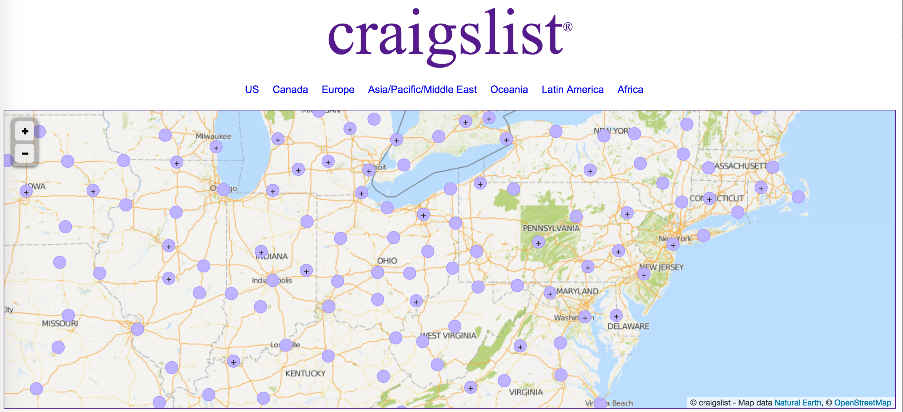

#Breaking down backpage intro metrics

The above picture is taken from craigslist, but the visual is better and more or less equivalent for backpage.  Second hand market places for goods and services have become ubiquitious across every community in the united states.  In fact, we can treat craigslist as a proxy for every community - the more people - the more craigslist's there will be.  This is because craigslist is not local - it exists for every community.  It is a digital representation of all our "informal" commerce.  Backpage operates very much the same way - except they have a much larger footprint in the sex slavery space and a somewhat smaller footprint in all other spaces.  
